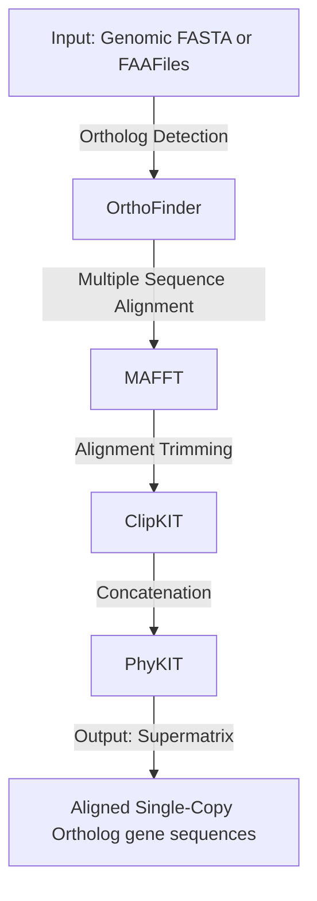

# Building a phylogenetic tree from whole bacterial genomes with Genome2Tree

This tutorial shows an easiy way to reconstruct a phylogenetic tree from whole genome bacterial genomes using the supermatrix approach. The workflow identifies orthologous single-copy genes shared between several bacteria genomes and constructs an aligned and concated supermatrix from the sequences which is ready to use for phylogenetic reconstruction. All of these steps are merged into one phyton based pipeline which can easily be used to calculate a concated gene supermatrix, which requires only the coding sequences of genes (nucleotides, present in **.ffn** outputs of common annotation platforms like Bakta, Prokka or PGAP) or proteins (**.fasta or .faa**) from the user in order to compute.


The pipeline bases on the following steps/programs:
1. **Identification of orthologs** using [**Orthofinder**](https://github.com/davidemms/OrthoFinder)
2. **Alignment** using [**MAFFT**](https://github.com/GSLBiotech/mafft)
3. **Trimming** using [**ClipKIT**](https://github.com/JLSteenwyk/ClipKIT)
4. **Concatenation** using [**PhyKIT**](https://github.com/JLSteenwyk/PhyKIT)



The pipeline can process nucleotide and amino acid sequences, and bases on the identification of orthologous single-copy genes or gene products shared between submitted .fasta or .faa files. By this usually several hundred or thousand of different shared genes are identified in the submitted genomes. These build the fundation for a robust reconstruction of the phylogenetic relationships of the investigated genomes. While the princple and the underlying programms are well known, the construction of the phylogenetic trees usually requires labour intense reformatting of the outputs from these single programms. I constructed and easy-to-use pipeline which allows the use to construct a concated supermatrix from their input .fasta or .faa files, which can further used for constructed a phylogenetic tree using standard programms like IQ-Tree2. 

# System Requirements and Initial Setup

This tutorial was created on an **Ubuntu 22.04** machine, and the steps are tailored for use on an Ubuntu system. While it may also work on other platforms, some adaptations might be necessary. **All commands should be typed directly in your terminal and executed there**. 

# Saving and formatting your input files

Your genomes of interest should be saved into one single folder only containing **.fasta or .fa** file types. If you want to run your analysis on nucleotide **.ffn** file, please make sure to correct the file extension to **.fasta** first, before running the pipeline. **Please note** if you want to root your tree later, you should consider adding a reference/out-group genome into the input folder. If no reference is added to the pipeline the resulting tree cannot be rooted in the downstream analysis.

# Setting up the environment

After saving the genomes in a specific folder, you need to create an environment for the analysis. This requires an installation of [**Miniconda**](https://www.anaconda.com/docs/getting-started/miniconda/main) on your system. You may first follow the steps explained under this link to properly install Miniconda on your system. 

We will create a Miniconda environment in which all analyses will be performed to avoid conflicts with existing software. The environment needs to be activated before use. Below is the code to set up and activate the Miniconda environment:

```
conda create -n genome2tree_env python=3.10
conda activate genome2tree_env
conda install -c bioconda genome2tree

```
## Running the pipeline
After setting up and activating your miniconda environment (you can deactivate the environment anytime using **conda deactivate**) you can run a test to confirm that the pipeline is correctly set-up
```
Genome2Tree.py --help

```
this should prompt the output,
```
Genome2Tree.py --help
usage: Genome2Tree.py [-h] -i INPUT -o OUTPUT [-p PREFIX] [-t THREADS] [--dna] [--force]

Pipeline to create a supermatrix from FASTA files

options:
  -h, --help            show this help message and exit
  -i INPUT, --input INPUT
                        Directory containing input FASTA files (.faa or .fna) (default: None)
  -o OUTPUT, --output OUTPUT
                        Output directory for all results (default: None)
  -p PREFIX, --prefix PREFIX
                        Prefix for output supermatrix files (default: supermatrix)
  -t THREADS, --threads THREADS
                        Number of threads to use (default: 4)
  --dna                 Input files are DNA (.fna) instead of protein (.faa) (default: False)
  --force               Force rerun of OrthoFinder even if results exist (default: False)

```
The script allows the user to specify the **input folder** (-i), where all of the input genomes are stored, and the **output folder** (-o) where all results should be saved into. Furthermore the user can specify how many CPU cores are used, which will have influence on the analysis time. With 8 cores expect for ~10 genomes around 10-20 min to complete, while 100 genomes will take several hours. The flag **--dna** should be used when working with nucleotide sequences. The flag **--force** can be used when you already ran Orthofinder and just want to re-run the pipeline starting after the detection of orthologous sequences.  
**Example 1: Protein sequences**
```
Genome2Tree.py -i /path/to/input_fastas/ -o /path/to/output -t 8
```

**Example 2: DNA sequences**
```
Genome2Tree.py -i /path/to/input_fastas/ -o /path/to/output -t 8 --dna
```

**Note** The pipeline cannot overwrite previous results, therefore it is suggested to save the output into a novel folder which will be created by the pipeline itself. So you can specify an existing path,followed by a folder name **/home/USER/FoldernameXYZ/** This folder doesn't have to exist before starting the pipeline, as it will be created during the process. 

## Creating the phylogenetic tree
After the analysis completed successfully you will find a file called **supermatrix.fa** in your output folder which is the overall output from the pipeline. This is a large concated matrix containing all the aligned sequences of all found orthologous genes/proteins of your genomes. This matrix can be used to construct a phylogenetic tree. In the subsequent steps the mode of action to create a phylogenetic tree from this supermatrix is briefly explained. First you need to install an appropriate software to calculate the tree for you, I use [**iqtree2**](https://github.com/iqtree/iqtree2) which can be installed in a separate miniconda environment. 
This can be called in the following way
```
conda activate iqtree_env #(or any other name you gave to your environment)
iqtree2 -s /path/to/your/supermatrixFile/supermatrix.fa -m MFP+MERGE+R --prefix model_test
```
This will run IQ-Tree in modelfinder mode, which will automatically identifiy the optimal substitution model for your supermatrix. After this is complete an output will appear in your terminal window indicating which model was found to be most suitable for your input sequences, alongside with already usuable tree files in various formats. If you want bootstrap support for your phylogenetic tree, the model should be re-run using the following code. Be aware that IQ-Tree in modelfinder mode might take a long time to finish, calculation times can be several days for ~100 genomes on common "standard" laptops. Hence, other programms might also be used to construct a tree from the supermatrix file. 
```
iqtree2 -s  /path/to/your/supermatrixFile/supermatrix.fa -m BEST_MODEL -B 1000 --prefix final_tree
```
With best model being any model, suggested by the modelfinder of IQ-Tree, these models usually look something like this "WAG+F+R7"

## Processing the phylogenetic tree
Once the phylogenetic tree is constructed you might wanna view, adapt and export the tree in a image format. This can easily be done by several software tools, of which I found [**TreeViewer**](https://treeviewer.org/) quite useful. This software can be downloaded under the link and is able to display the different output formats produced by IQ-Tree and export your phylogenetic tree as images as a final output of your analysis. 
